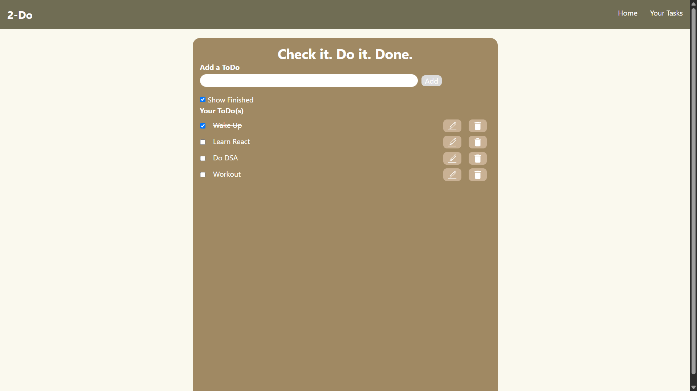
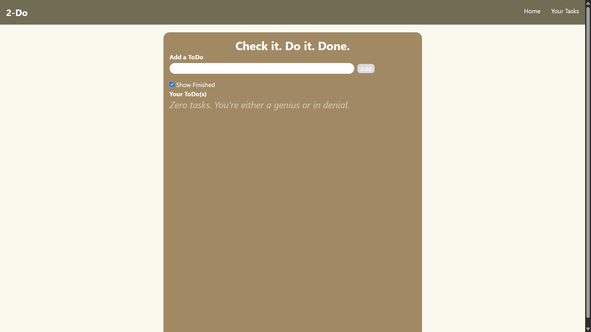
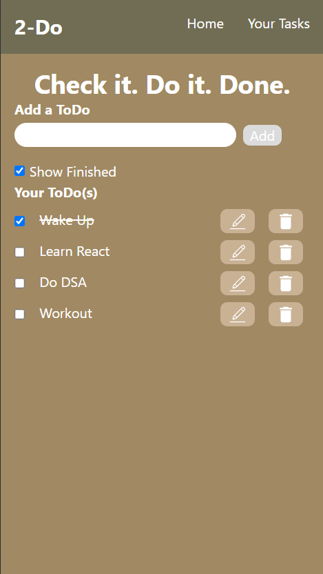

# 2-Do ✅  
_A minimal, ToDo app — because productivity deserves attitude._  

---

## 📌 Features  
- ➕ Add, ✏️ Edit, and 🗑️ Delete todos.  
- ✅ Mark tasks as complete/incomplete.  
- 👀 Toggle finished tasks (show/hide).  
- 💾 Saves tasks in **localStorage**.  
- 🎭 Fun sarcastic message when no tasks exist.  
- ⚡ Responsive UI with **React + Tailwind CSS**.  

---

## 🛠️ Tech Stack  
- **React** – Frontend library.  
- **Tailwind CSS** – Utility-first styling.  
- **React Icons** – Modern icons.  
- **UUID** – Unique IDs for todos.  

---

## 📸 Screenshots  

### 🖥️ Desktop View  
  
  

### 📱 Mobile View  
  
